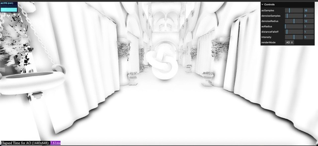
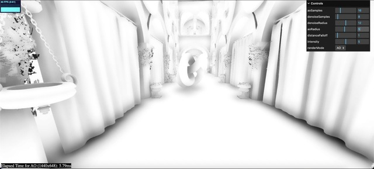
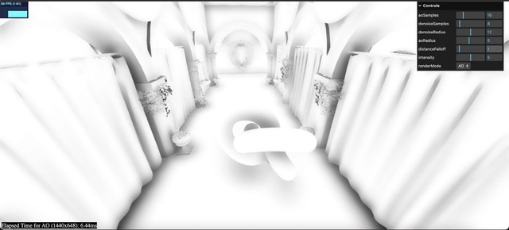
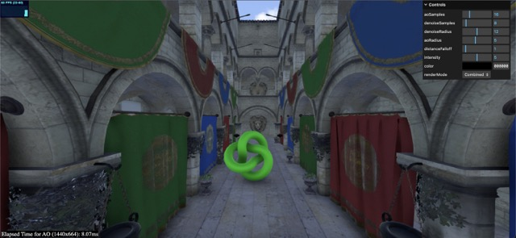
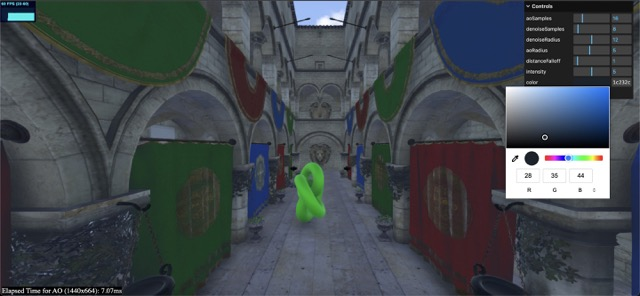
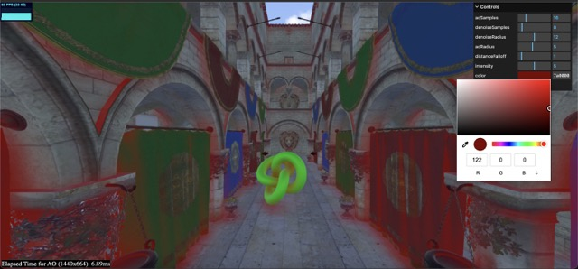
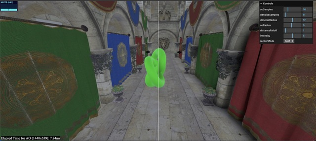

# N8AO
[](https://www.npmjs.com/package/n8ao)
[](https://github.com/n8python/n8ao/)
[](https://twitter.com/n8programs)

An efficient and visually pleasing implementation of SSAO with an emphasis on temporal stability and artist control.

AO is critical for creating a sense of depth in any 3D scene, and it does so by darkening parts of the scene that geometry blocks light from reaching. This effect is most noticeable in corners, crevices, and other areas where light is occluded. I'd recommend using this package in any scene that looks "flat" or "fake", or in any scene with vague depth cues and a lack of strong directional lighting.


[Example](https://n8python.github.io/n8ao/example/)
(Source code in /example)
  
Scene w/ AO applied:  

[](https://n8python.github.io/n8ao/example/)

(Left) Scene w/o AO, (Right) Scene w/ AO:  

[](https://n8python.github.io/n8ao/example/)

# Installation

From npm: `npm install n8ao` -> `import {N8AOPass} from "n8ao"`

From cdn: `import {N8AOPass} from "https://unpkg.com/n8ao@latest/dist/N8AO.js"`

Or just download `dist/N8AO.js` and `import {N8AOPass} from "N8AO.js"`

In order to ensure maximum compatibility, you must have the packages "three" and "postprocessing" defined in your environment - you can do this by CDN, as in the examples, or by installing them via npm.
# Usage

It's very simple - `N8AOPass` is just a threejs postprocessing pass.

Import `EffectComposer` and:

```js
const composer = new EffectComposer(renderer);
// N8AOPass replaces RenderPass
const n8aopass = new N8AOPass(
        scene,
        camera,
        width,
        height
    );
composer.addPass(n8aopass);
```

This is all you need to do. The effect should work out of the box with any vanilla three.js scene, and as long as the depth buffer is being written to, generate ambient occlusion.

Use of `SMAAPass` (as hardware antialiasing does NOT work with ambient occlusion) is recommended to reduce aliasing.

Gamma correction is enabled by default, but it should be disabled if you have a gamma correction pass later in your postprocessing pipeline, to avoid double-correcting your colors:

```js
n8aopass.configuration.gammaCorrection = false;
```

# Usage (Postprocessing)

If you are using the pmndrs/postprocessing package, N8AO is compatible with it. Simply do:

```js
import { N8AOPostPass } from "n8ao";
import { EffectComposer, RenderPass } from "postprocessing";

// ... 

const composer = new EffectComposer(renderer);
/* The only difference is that N8AOPostPass requires a RenderPass before it, whereas N8AOPass replaces the render pass. Everything else is identical. */
composer.addPass(new RenderPass(scene, camera));
const n8aopass = new N8AOPostPass(
    scene,
    camera,
    width,
    height
);
composer.addPass(n8aopass)

/* SMAA Recommended */
composer.addPass(new EffectPass(camera, new SMAAEffect({
    preset: SMAAPreset.ULTRA
})));
```
N8AOPostPass's API is identical to that of N8AOPass (so all docs below apply), except it is compatible with pmndrs/postprocessing. 

Small note: N8AOPostPass's `configuration.gammaCorrection` is automatically set to the correct value based on its position in your postprocessing pipeline. If it is the last pass, it is set to true. Otherwise, it is set to false. This is to ensure that gamma correction is only applied once. However, sometimes this automatic detection fails, so if you are getting washed out colors, try setting `configuration.gammaCorrection` to false, and if you are getting dark colors, try setting it to true.


# Usage (Detailed)

`N8AOPass` is designed to be as easy to use as possible. It works with logarithmic depth buffers and orthographic cameras, supports materials with custom vertex displacement and alpha clipping, and automatically detects the presence of these things so you do not need to deal with user-side configuration.

However, some tweaking is often necessary to make sure your AO effect looks proper and does not suffer from artifacts. There are four principal parameters that control the visual "look" of the AO effect: `aoRadius`, `distanceFalloff`, `intensity`, and `color`. They can be changed in the following manner:

```js
n8aopass.configuration.aoRadius = 5.0;
n8aopass.configuration.distanceFalloff = 1.0;
n8aopass.configuration.intensity = 5.0;
n8aopass.configuration.color = new THREE.Color(0, 0, 0);
```

They are covered below:


`aoRadius: number` - The most important parameter for your ambient occlusion effect. Controls the radius/size of the ambient occlusion in world units. Should be set to how far you want the occlusion to extend from a given object. Set it too low, and AO becomes an edge detector. Too high, and the AO becomes "soft" and might not highlight the details you want. The radius should be one or two magnitudes less than scene scale: if your scene is 10 units across, the radius should be between 0.1 and 1. If its 100, 1 to 10. 

|  |  |  |
|:---:|:---:|:---:|
| Radius 1 | Radius 5 | Radius 10 |

`distanceFalloff: number` - The second most important parameter for your ambient occlusion effect. Controls how fast the ambient occlusion fades away with distance in proportion to its radius. Defaults to 1, and behind-the-scenes, is a calculated as a ratio of your radius (0.2 * distanceFalloff is the size used for attenuation). Decreasing it reduces "haloing" artifacts and improves the accuracy of your occlusion, but making it too small makes the ambient occlusion disappear entirely. 

|  |  |  |
|:---:|:---:|:---:|
| Distance Falloff 0.1 | Distance Falloff 1 | Distance Falloff 5 |

### Migration Notice
The API changed slightly with N8AO 1.7 - the only change you should have to make is adjusting your `distanceFalloff` parameter - choosing 1.0 is a safe value. For the exact same results you had before, you can do `distanceFalloff = 5.0 * oldDistanceFalloff / radius`.

`intensity: number` - A purely artistic control for the intensity of the AO - runs the ao through the function `pow(ao, intensity)`, which has the effect of darkening areas with more ambient occlusion. Useful to make the effect more pronounced. An intensity of 2 generally produces soft ambient occlusion that isn't too noticeable, whereas one of 5 produces heavily prominent ambient occlusion. 

`color: THREE.Color` - The color of the ambient occlusion. By default, it is black, but it can be changed to any color to offer a crude approximation of global illumination. Recommended in scenes where bounced light has a uniform "color", for instance a scene that is predominantly lit by a blue sky. The color is expected to be in the sRGB color space, and is automatically converted to linear space for you. Keep the color pretty dark for sensible results.

|  |  |  |
|:---:|:---:|:---:|
| Color Black (Normal AO) | Color Blue (Appropriate) | Color Red (Too Bright) |

# Screen Space Radius

If you want the AO to calculate the radius based on screen space, you can do so by setting `configuration.screenSpaceRadius` to `true`. This is useful for scenes where the camera is moving across different scales a lot, or for scenes where the camera is very close to the objects.

When `screenSpaceRadius` is set to `true`, the `aoRadius` parameter represents the size of the ambient occlusion effect in pixels (recommended to be set between 16 and 64). The `distanceFalloff` parameter becomes a ratio, representing the percent of the screen space radius at which the AO should fade away - it should be set to 0.2 in most cases, but it accepts any value between 0 and 1 (technically even higher than 1, though that is not recommended).

# Using your own render target

If you're utilizing the standard `N8AOPass`, there might be a situation where you have a pre-existing render target with a depth buffer that you'd prefer `N8AOPass` to use, instead of it generating a new one. To accomplish this, you can assign your render target to `n8aopass.beautyRenderTarget`.

N8AOPass will still render to `n8aopass.beautyRenderTarget` by default, but you can change this by setting `n8aopass.configuration.autoRenderBeauty` to `false`. If you do this, it's up to you to render the scene to `n8aopass.beautyRenderTarget` before using `N8AOPass`.

Finally, your render target must have a depth buffer attached to it. Otherwise, `N8AOPass` will not work and may fail silently.

You can attach a depth buffer to your render target by doing:

```js
const renderTarget = new THREE.WebGLRenderTarget(width, height);
// If you just want a depth buffer
renderTarget.depthTexture = new THREE.DepthTexture(width, height, THREE.UnsignedIntType);
renderTarget.depthTexture.format = THREE.DepthFormat;
// If you want a depth buffer and a stencil buffer
renderTarget.depthTexture = new THREE.DepthTexture(width, height, THREE.UnsignedInt248Type);
renderTarget.depthTexture.format = THREE.DepthStencilFormat;
```


# Performance
`N8AOPass` has a "half-resolution" mode for performance-critical applications. Enabling it is as simple as doing:

```js
n8aopass.configuration.halfRes = true;
```

This will cause the AO to be calculated at half the resolution of the screen, and then upscaled to the full resolution. This is a great way to get a performance boost (generally 2x-4x) at the cost of some quality (the AO will lack fine details and temporal stability will be slightly reduced).

The half-resolution mode uses depth-aware upscaling by default, and this generally incurs a fixed cost of around 1ms. The AO effect looks horrible without depth-aware upscaling, so it is not recommended to disable it. However, if performance is truly that critical, you can do so by setting `configuration.depthAwareUpsampling` to `false`.

On top of half-resolution mode,`N8AOPass` comes with a wide variety of quality presets (which can be used with or without half-resolution mode), and you can even manually edit the settings to your liking. You can switch between quality modes (the default is `Medium`) by doing:

```js
n8ao.setQualityMode("Low"); // Or any other quality mode
```

The quality modes are as follows:

*Temporal stability refers to how consistent the AO is from frame to frame - it's important for a smooth experience.*
| Quality Mode | AO Samples | Denoise Samples | Denoise Radius | Best For
|:---:|:---:|:---:|:---:|:---:|
| Performance (Less temporal stability, a bit noisy) | 8 | 4 | 12 | Mobile, Low-end iGPUs and laptops |
| Low (Temporally stable, but low-frequency noise) | 16 | 4 | 12 | High-End Mobile, iGPUs, laptops |
| Medium (Temporally stable and barely any noise) | 16 | 8 | 12 | High-End Mobile, laptops, desktops |
| High (Significantly sharper AO, barely any noise) | 64 | 8 | 6 | Desktops, dedicated GPUs  |
| Ultra (Sharp AO, No visible noise whatsoever) | 64 | 16 | 6 | Desktops, dedicated GPUs|

Generally, half-res mode at "Ultra" quality is slightly slower than full-res mode at "Performance" quality, but produces significantly better results.

If you wish to make entirely custom quality setup, you can manually change `aoSamples`, `denoiseSamples` and the `denoiseRadius` in the `configuration` object.

```js 
n8aopass.configuration.aoSamples = 16;
n8aopass.configuration.denoiseSamples = 8;
n8aopass.configuration.denoiseRadius = 12;
```

Either way, changing the quality or any of the above variables is expensive as it forces a recompile of all the shaders used in the AO effect. It is recommended to do this only once, at the start of your application. Merely setting the values each frame to some constant does not trigger recompile, however.

# Debug Mode

If you want to track the exact amount of time the AO render pass is taking in your scene, you can enable debug mode by doing:

```js
n8aopass.enableDebugMode(); // Disable with n8aopass.disableDebugMode();
```

Then, the `n8aopass.lastTime` variable, which is normally undefined, will have a value set each frame which represents the time, in milliseconds, the AO took to render (the value typically lags behind a few frames due to the CPU and GPU being slightly out of sync). This is useful for debugging performance issues.

Note that debug mode relies on WebGL features that are not available in all browsers - so make sure you are using a recent version of a Chromium browser while debugging. If your browser does not support these extra features (EXT_disjoint_timer_query_webgl2), debug mode will not work and an error will be thrown. The rest of the AO will still function as normal.

# Display Modes

`N8AOPass` comes with a variety of display modes that can be used to debug/showcase the AO effect. They can be switched between by doing:

```js
n8aopass.setDisplayMode("AO"); // Or any other display mode
```

The display modes available are:

| Display Mode | Description |
|:---:|:---:|
| Combined | Standard option, composites the AO effect onto the scene to modulate lighting - what you should use in production  |
| AO | Shows only the AO effect as a black (completely occluded) and white (no occlusion) image  |
| No AO | Shows only the scene without the AO effect   |
| Split | Shows the scene with and without the AO effect side-by-side (divided by a white line in the middle)  |
| Split AO | Shows the AO effect as a black and white image, and the scene with the AO effect applied side-by-side (divided by a white line in the middle)  |

# Transparency

N8AO supports transparency as best as it can - transparent objects with depthWrite disabled will not occlude anything and look completely correct. Transparent object with depthWrite enabled may lead to slight artifacts, but on the whole look fine (as long as their alpha value isn't too low).

The transparency solution used by N8AO is based of auxillary render target storing
the accumulated alpha for each pixel - meaning that in order for transparency to work, all transparent objects **will be rendered twice**. This normally isn't a problem, but if you have a lot of transparent objects that fill up a large portion of the screen, it can be a significant performance hit.

Transparency is automatically enabled in scenes that have transparent objects in them, but can be set manually via `configuration.transparencyAware`:

```js
n8aopass.configuration.transparencyAware = true;
```

Setting this value disables automatic transparency detection.

You can also force N8AO to treat a transparent object as opaque (useful if you are using transparency in a non-traditional manner and want N8AO to ignore it - for instance, with three.js's ShadowMesh), by setting `treatAsOpaque` to `true` in the object's `userData`:

```js
mesh.userData.treatAsOpaque = true;
```

# Stencil

N8AOPass supports stencil buffers, but you must enable them via `configuration.stencil`:

```js
n8aopass.configuration.stencil = true;
```

N8AOPostPass does not have such an option, as `pmndrs/postprocessing` has its own API for stencil buffers, which is shown below:

```js
 const composer = new EffectComposer(renderer, {
        stencilBuffer: true, // stencil
        depthBuffer: true,
        frameBufferType: THREE.HalfFloatType
});
const renderPass = new RenderPass(scene, camera);
renderPass.clearPass.setClearFlags(true, true, true); // Ensures that the render pass clears the stencil buffer
composer.addPass(renderPass);
const n8aopass = new N8AOPostPass(
        scene,
        camera,
        clientWidth,
        clientHeight
    );
composer.addPass(n8aopass);
```

# Compatibility

`N8AOPass` is compatible with all modern browsers that support WebGL 2.0 (WebGL 1 is not supported), but using three.js version r152 or later is recommended. 

The pass is self-contained, and renders the scene automatically. The render target containing the scene texture (and depth) is available as `n8aopass.beautyRenderTarget` if you wish to use it for other purposes (for instance, using a depth buffer later in the rendering pipeline). All pass logic is self-contained and the pass should not be hard to modify if necessary.

# Limitations

Like all screen space methods, geometry that is offscreen or is blocked by another object will not actually occlude anything. Haloing is still a minor issue in some cases, but it is not very noticeable.

Generally, the effect will appear to be grounded completely in world-space, with few view dependent artifacts. Only if one is specifically looking for them will they be found.

# Contributing

Clone the repo:

`git clone https://github.com/N8python/n8ao.git`

Start the dev server:
```
npm run dev
```

The example  can be accessed `localhost:8080/example`. The source code for the example is in `/example`.

# License

A CC0 license is used for this project. You can do whatever you want with it, no attribution is required. However, if you do use it, I'd love to hear about it!

# Credits

Too many papers and inspirations to count, but here's a list of resources that have been helpful to me:

https://threejs.org/examples/?q=pcss#webgl_shadowmap_pcss
https://www.shadertoy.com/view/4l3yRM
https://learnopengl.com/Advanced-Lighting/SSAO
https://github.com/mrdoob/three.js/blob/dev/examples/jsm/postprocessing/SSAOPass.js
https://pmndrs.github.io/postprocessing/public/docs/class/src/effects/SSAOEffect.js~SSAOEffect.html
https://github.com/Calinou/free-blue-noise-textures
https://iquilezles.org/articles/multiresaocc/


